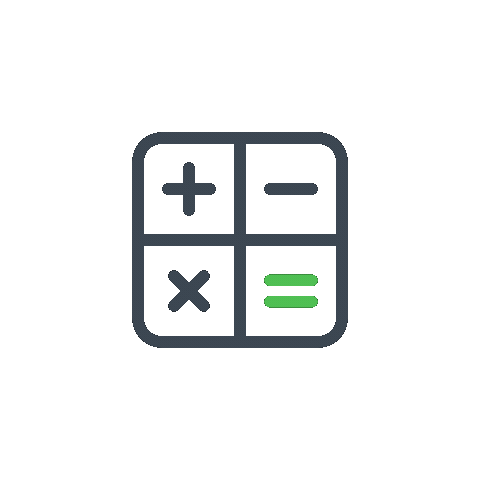

# 🧠 Mental Arithmetic – Android App

A .NET Maui for Android application designed to help you practice and improve your **mental arithmetic skills** through quick and focused exercises.

The app currently supports the following operations:
- ➕ Addition  
- ➖ Subtraction  
- ✖️ Multiplication  

More features are planned to make the experience richer and more customizable.

---

## ✨ Features

- Clean and simple interface
- Fast mental calculation exercises
- Suitable for daily training and skill improvement

---

## 🛣️ Roadmap

### Implemented
- [x] Addition
- [x] Subtraction
- [x] Multiplication
- [X] Division

### Planned
- [ ] Configurable game modes
- [ ] Random operation mode
- [ ] User management (profiles & score tracking)

---

## 🚀 Goal

The goal of this project is to provide a lightweight and efficient tool to train mental calculation, while keeping the codebase clean and extensible for future features.
